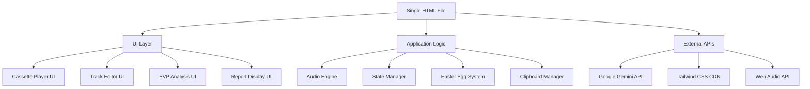

# Design Document

## Overview

Spec-Tape is a single-file HTML web application that recreates the nostalgic experience of 1990s mixtape creation with a paranormal twist. The application combines a functional cassette player interface with AI-powered EVP (Electronic Voice Phenomena) analysis, creating shareable "Spectral Interlude" reports for the Kiroween event.

## Architecture

### High-Level Architecture



### Technology Stack

- **Frontend**: Single HTML file with embedded CSS and JavaScript
- **Styling**: Tailwind CSS (CDN)
- **Audio**: Web Audio API with Tone.js for sound generation
- **AI Backend**: Google Gemini API (gemini-2.5-flash-preview-09-2025)
- **State Management**: Vanilla JavaScript object state
- **No Database**: Session-based, shareable artifacts

## Components and Interfaces

### 1. Cassette Player Component

**Purpose**: Provides the main visual interface mimicking a 90s boombox/cassette player

**Key Elements**:
- Central cassette display with animated tape spools
- Play/Pause/Stop control buttons
- Side A/B selector switch
- Volume and tone controls (visual only)
- LED-style display for current track info

**CSS Classes**:
```css
.boombox-container { /* Main container with 90s styling */ }
.cassette-display { /* Central cassette visual */ }
.tape-spool { /* Animated spinning elements */ }
.control-button { /* 3D button styling */ }
.side-selector { /* A/B switch component */ }
```

### 2. Track Editor Component

**Purpose**: Allows users to customize mixtape content

**Key Elements**:
- Mixtape title input field
- Side A track list (up to 10 tracks)
- Side B track list (up to 10 tracks)
- Track duration display (placeholder)
- Total side duration calculator

**Data Structure**:
```javascript
const mixtapeData = {
  title: "Kiroween Jams Vol. 1",
  sideA: [
    { name: "Track 1", duration: "3:45" },
    { name: "Track 2", duration: "4:12" }
  ],
  sideB: [
    { name: "Track 3", duration: "2:58" }
  ]
};
```

### 3. EVP Analysis Component

**Purpose**: Core feature for paranormal audio transcript analysis

**Key Elements**:
- Spectral Interlude section header
- EVP transcript input textarea (500 char limit)
- "ANALYZE SPECTRAL DATA" submit button
- Loading indicator during API processing
- Error handling for API failures

**Input Validation**:
- Non-empty transcript required
- Character limit enforcement
- Sanitization of special characters

### 4. Analysis Report Component

**Purpose**: Displays structured AI-generated EVP analysis results

**Report Structure**:
```javascript
const analysisReport = {
  classification: "Class A (Clear)", // Class A/B/C
  valence: "Hostile", // Hostile/Neutral/Playful/Distress
  phoneticAnomalies: "Reversed phonemes with spectral distortion",
  suggestedMeaning: "Warning about temporal displacement"
};
```

**Display Format**:
- Monospace font styling
- Green-on-black terminal aesthetic
- Structured data presentation
- Copy-to-clipboard functionality

### 5. Easter Egg System

**Purpose**: Hidden interactive features for enhanced engagement

**Konami Code Handler**:
```javascript
const konamiSequence = [
  'ArrowUp', 'ArrowUp', 'ArrowDown', 'ArrowDown',
  'ArrowLeft', 'ArrowRight', 'ArrowLeft', 'ArrowRight',
  'KeyB', 'KeyA', 'Enter'
];
```

**Hidden Click Handler**:
- Tracks clicks on cassette label area
- Triggers bass drop after 5 consecutive clicks
- Resets counter after 30-second timeout

## Data Models

### Application State

```javascript
const appState = {
  // Mixtape data
  mixtape: {
    title: "",
    sideA: [],
    sideB: []
  },
  
  // Player state
  player: {
    isPlaying: false,
    currentSide: "A",
    currentTrack: 0,
    volume: 0.7
  },
  
  // EVP analysis
  evp: {
    transcript: "",
    isAnalyzing: false,
    report: null,
    error: null
  },
  
  // Easter eggs
  easterEggs: {
    konamiProgress: 0,
    hiddenClicks: 0,
    lastClickTime: 0
  }
};
```

### API Integration Schema

**Gemini API Request**:
```javascript
const apiPayload = {
  contents: [{ parts: [{ text: userTranscript }] }],
  systemInstruction: { 
    parts: [{ text: systemPrompt }] 
  },
  generationConfig: {
    responseMimeType: "application/json",
    responseSchema: {
      type: "OBJECT",
      properties: {
        classification: { type: "STRING" },
        valence: { type: "STRING" },
        phoneticAnomalies: { type: "STRING" },
        suggestedMeaning: { type: "STRING" }
      }
    }
  }
};
```

## Error Handling

### API Error Scenarios

1. **Network Failure**: Display "Spectral interference detected" message
2. **API Rate Limiting**: Show "Paranormal activity overload" with retry option
3. **Invalid Response**: Fall back to mock analysis report
4. **Timeout**: Cancel request after 15 seconds with error message

### Input Validation Errors

1. **Empty Transcript**: "No spectral data detected for analysis"
2. **Character Limit**: "Transcript exceeds spectral capacity (500 chars max)"
3. **Invalid Characters**: Sanitize and proceed with cleaned input

### Audio System Errors

1. **Web Audio API Unavailable**: Disable audio features gracefully
2. **Sound Loading Failure**: Use silent placeholders
3. **Browser Compatibility**: Provide fallback for older browsers

## Testing Strategy

### Unit Testing Focus Areas

1. **State Management**: Verify state updates and persistence
2. **Input Validation**: Test all validation rules and edge cases
3. **API Integration**: Mock API responses and error conditions
4. **Easter Egg Logic**: Verify sequence detection and timing

### Integration Testing

1. **UI Interactions**: Test all button clicks and form submissions
2. **Audio Playback**: Verify play/pause/stop functionality
3. **Clipboard Operations**: Test copy-to-clipboard across browsers
4. **Responsive Behavior**: Ensure layout works across screen sizes

### Browser Compatibility Testing

- **Chrome**: Primary target browser
- **Firefox**: Secondary support
- **Safari**: Basic functionality verification
- **Edge**: Compatibility check

## Visual Design Specifications

### Color Palette

- **Background**: #111827 (Dark charcoal)
- **Neon Purple**: #BF40BF (Primary accent)
- **Radioactive Green**: #40BF40 (Success/active states)
- **Shock Orange**: #FF8C00 (Warning/highlight)
- **Terminal Green**: #00FF00 (Report display)

### Typography

- **Primary**: Monospace system fonts
- **Display**: Pixel-style fonts where available
- **Sizes**: Large buttons (16px+), readable text (14px+)

### Animation Effects

1. **Tape Spool Rotation**: CSS keyframe animation during playback
2. **Button Press**: 3D depression effect on click
3. **Static Overlay**: Full-screen green filter for Konami code
4. **Loading Spinner**: Rotating spectral analysis indicator

### Layout Structure

```
┌─────────────────────────────────────┐
│           SPEC-TAPE HEADER          │
├─────────────────────────────────────┤
│                                     │
│         CASSETTE PLAYER UI          │
│    [Play] [Pause] [Stop] [A/B]     │
│                                     │
├─────────────────────────────────────┤
│         TRACK EDITOR SECTION        │
│    Title: [________________]        │
│    Side A: [Track listings...]      │
│    Side B: [Track listings...]      │
├─────────────────────────────────────┤
│       SPECTRAL INTERLUDE            │
│    EVP Transcript:                  │
│    [Text area for input...]         │
│    [ANALYZE SPECTRAL DATA]          │
├─────────────────────────────────────┤
│        ANALYSIS REPORT              │
│    [Structured report display]      │
│    [TRANSMIT REPORT]                │
└─────────────────────────────────────┘
```

This design provides a comprehensive foundation for implementing the Spec-Tape application with all required features while maintaining the authentic 90s aesthetic and paranormal theme.